# N11 Talenthub Bootcamp Final Project

E-commerce platform built as a Spring Boot microservices backend with a TanStack Start (React) storefront. Orchestrates the full purchase flow — browse, cart, checkout, iyzipay payment, shipping, returns/refunds — using a saga choreography over RabbitMQ.

## Documentation

- [DEVELOPMENT.md](./DEVELOPMENT.md) — local setup, run, common commands
- [SAGA.md](./SAGA.md) — saga design notes

## Stack

- **Backend**: Java 21, Spring Boot 3.5, Spring Cloud 2025.0.2, Maven
- **Frontend**: TanStack Start (React + Nitro SSR), Tailwind v4, shadcn/ui
- **Auth**: Keycloak 26 (OAuth2 / JWT)
- **Messaging**: RabbitMQ
- **Storage**: PostgreSQL, Redis
- **Payment**: iyzipay (sandbox)
- **Deploy**: Docker Compose / Kubernetes

## Architecture

End-to-end deployment topology:

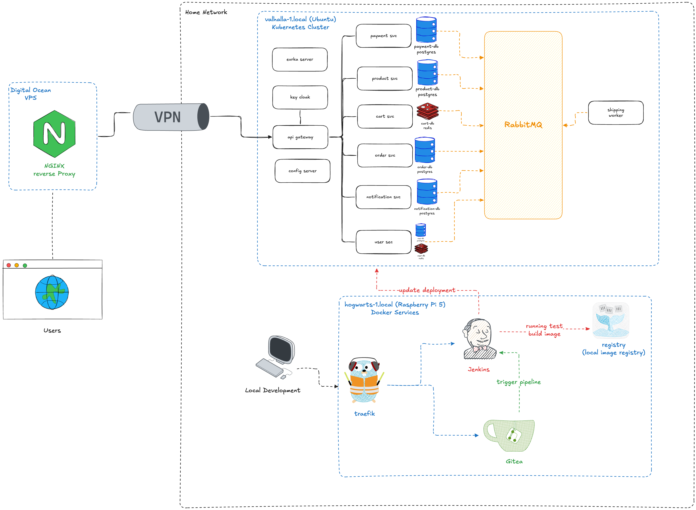

### Edge & Ingress

- **DigitalOcean VPS** runs NGINX as a public reverse proxy.
- Traffic enters through a **VPN tunnel** into the home network — the cluster is never exposed to the public internet directly.

### Production Cluster — `hogwarts/local` (Kubernetes, 3 nodes)

All application services run in a self-hosted Kubernetes cluster:

| Component          | Role                                                         |
| ------------------ | ------------------------------------------------------------ |
| `api-gateway`      | Spring Cloud Gateway — routes `/api/**` to internal services |
| `product-svc`      | Catalog, stock — PostgreSQL `product-db`                     |
| `cart-svc`         | Cart — Redis (`cart-db`)                                     |
| `order-svc`        | Order lifecycle, saga — PostgreSQL `order-db`                |
| `payment-svc`      | iyzipay integration — PostgreSQL `payment-db`                |
| `user-svc`         | Profile + Keycloak — PostgreSQL `user-db` + Redis            |
| `notification-svc` | SSE notifications — PostgreSQL                               |
| `shipping-worker`  | RabbitMQ-only worker (no HTTP)                               |
| `RabbitMQ`         | Topic exchange `events` — saga choreography backbone         |

### Build & Delivery — `vidulta/local` (Raspberry Pi 5, Docker)

Lightweight CI/CD host running alongside developer machines:

| Service    | Role                                                                                     |
| ---------- | ---------------------------------------------------------------------------------------- |
| `Traefik`  | Reverse proxy in front of Jenkins + Gitea                                                |
| `Gitea`    | Git remote — push triggers webhook                                                       |
| `Jenkins`  | Runs tests, builds container images, pushes to registry, then updates the K8s deployment |
| `registry` | Cloud image registry consumed by the cluster                                             |

### Flow

```
[user] → DO VPS (NGINX) → VPN → api-gateway → svc → svc-db
                                          ↘  RabbitMQ ↔ shipping-worker / notification-svc

[dev] → Gitea push → Jenkins → build & test → push image → update K8s deployment
```

### Services

| Service        | Type   | Port | Responsibility                             |
| -------------- | ------ | ---- | ------------------------------------------ |
| `eureka`       | infra  | 8761 | Service discovery                          |
| `config`       | infra  | 8888 | Centralized config                         |
| `gateway`      | edge   | 8080 | Routing, JWT validation, header injection  |
| `product`      | http   | —    | Catalog, stock, images, filters            |
| `cart`         | http   | —    | Redis-backed cart                          |
| `order`        | http   | —    | Order lifecycle, saga orchestration        |
| `user`         | http   | —    | Profile, addresses, Keycloak signup/signin |
| `payment`      | http   | —    | iyzipay integration, refund                |
| `notification` | http   | —    | SSE notifications                          |
| `shipping`     | worker | —    | Async shipping state transitions           |
| `client-web`   | http   | —    | TanStack Start storefront (SSR)            |

### Order Saga (choreography)

```
POST /api/orders            → CHECKOUT (stock held 10 min)
POST /api/orders/{id}/pay   → iyzipay hosted page
  iyzipay callback → publish payment.accepted | payment.rejected
order:    payment.accepted  → PAID
shipping: payment.accepted  → shipping.processing → shipping.delivering → shipping.delivered
order:    shipping.delivered→ DELIVERED
return:   user starts return → RETURNING → RETURN_SHIPPED → REFUNDING → RETURNED
```

Statuses: `CHECKOUT → PENDING → PAID → SHIPPED → DELIVERED → COMPLETED`. Branches: `CANCELLED`, `RETURNING → RETURN_SHIPPED → REFUNDING → RETURNED`, `RETURN_FAILED` (retryable).

## Previews

### Storefront

| Products | Product Detail |
| --- | --- |
| 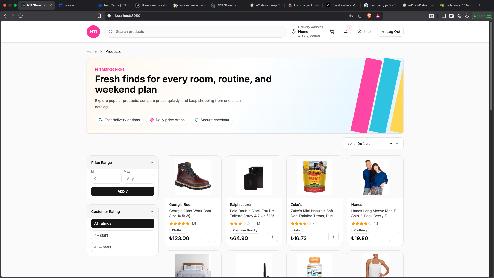 | 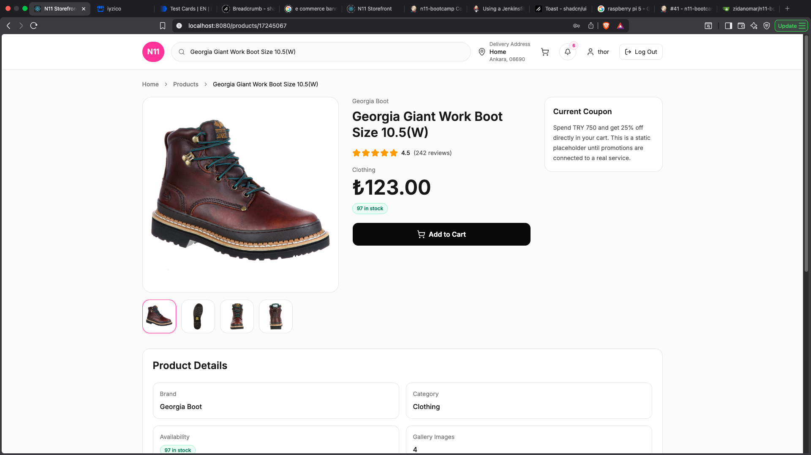 |

| Login | Notifications |
| --- | --- |
| 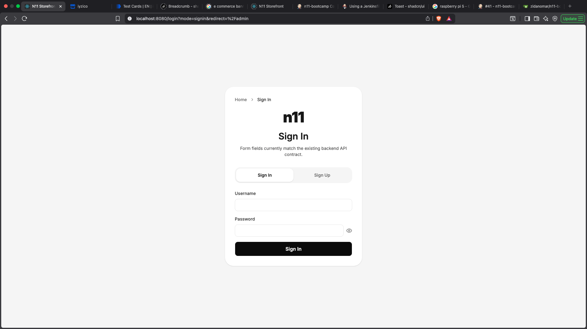 | 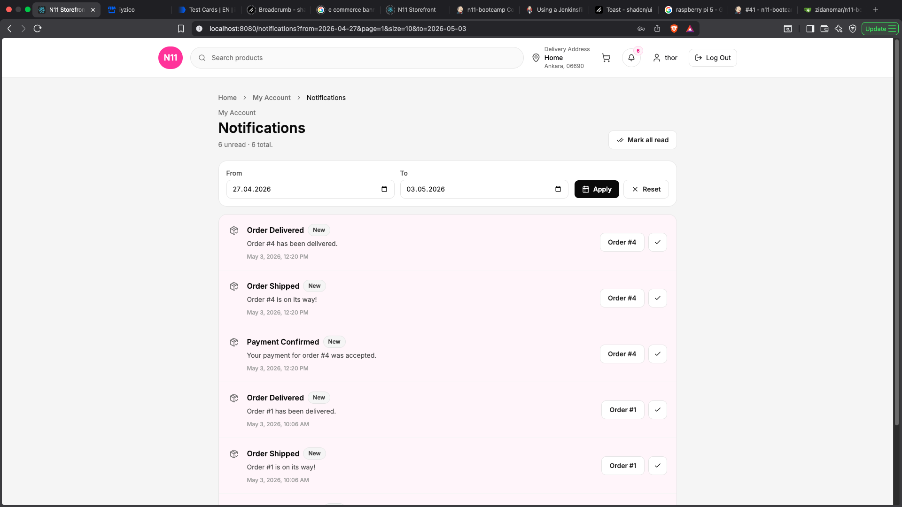 |

| Orders | Order Detail |
| --- | --- |
| 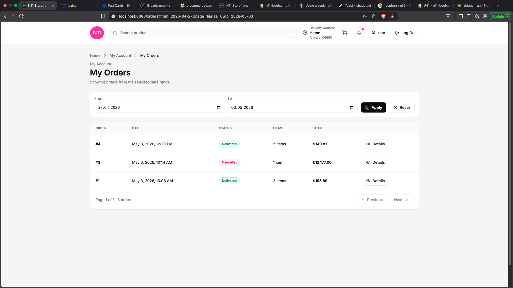 | 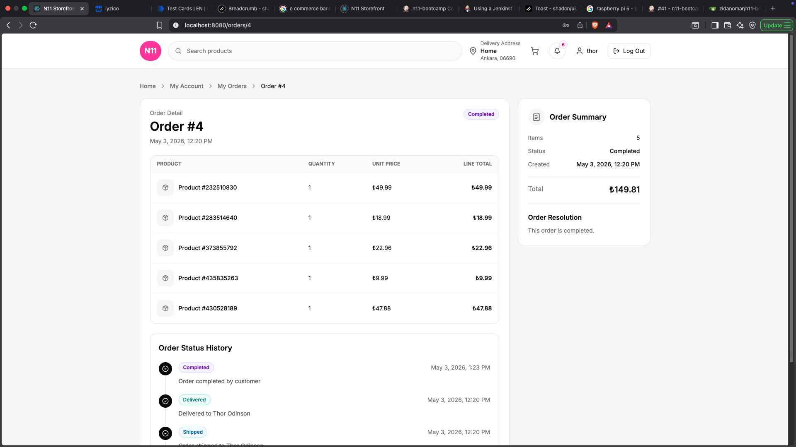 |

| Forbidden (403) | Not Found (404) |
| --- | --- |
| 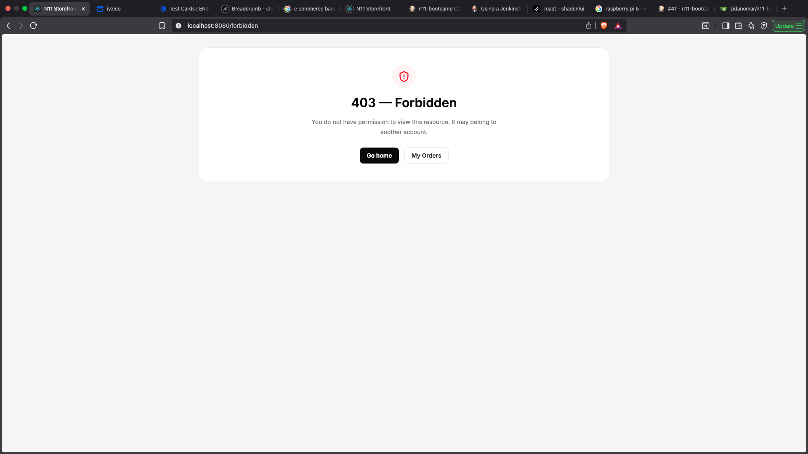 | 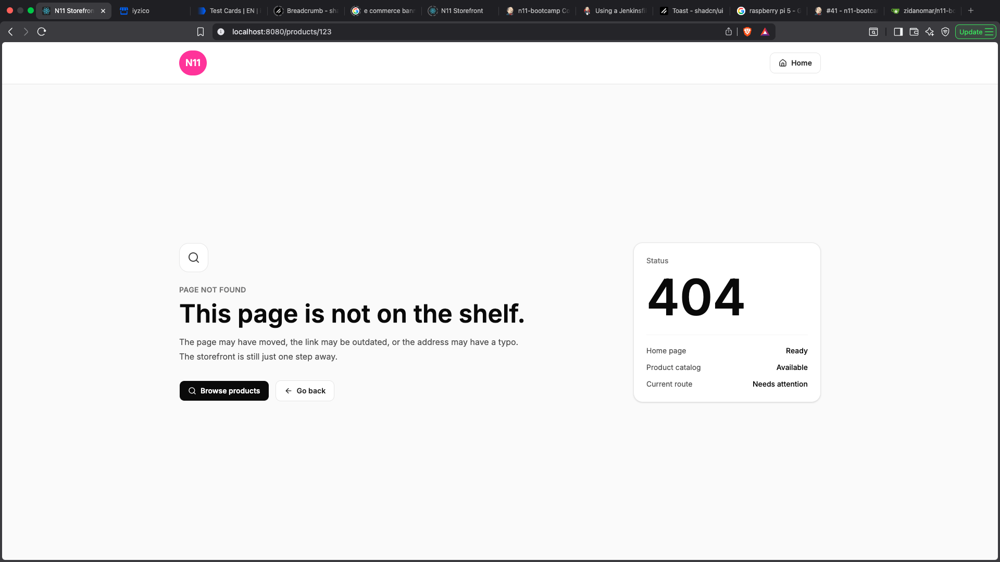 |

### CI/CD

| Gitea | Jenkins |
| --- | --- |
| 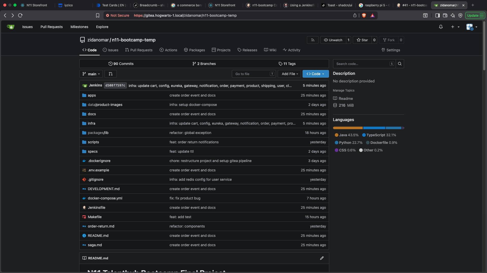 | 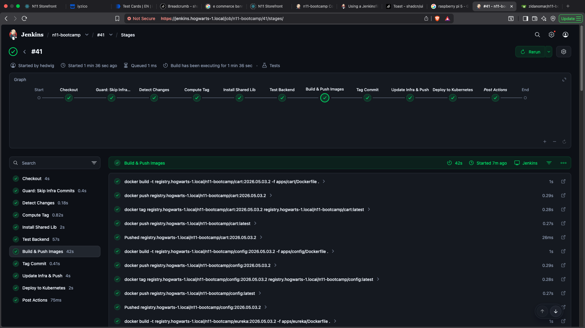 |

## Repository Layout

```
apps/
  config/         # Spring Cloud Config server
  eureka/         # Service registry
  gateway/        # Spring Cloud Gateway
  product/        # Product service
  cart/           # Cart service (Redis)
  order/          # Order service + saga listeners
  payment/        # iyzipay integration
  user/           # User profile + Keycloak
  notification/   # SSE notifications
  shipping/       # RabbitMQ worker
  web/            # TanStack Start frontend
packages/         # Shared Java libraries
infra/            # Keycloak realm, RabbitMQ defs
data/             # Volume mounts (product images, postgres)
docker-compose.yml
Jenkinsfile       # CI pipeline
Makefile          # Per-service test targets
```
